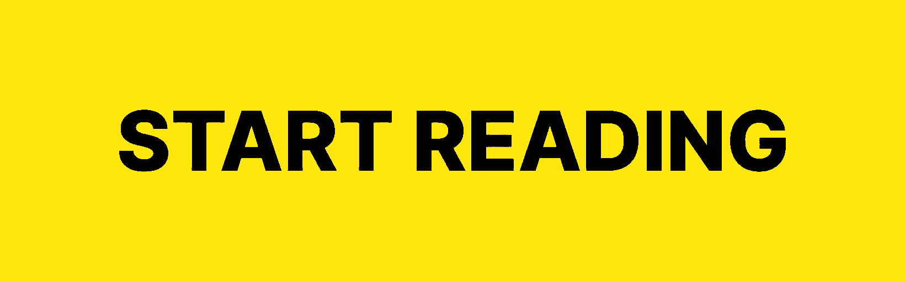

<h1 align="center">Javascript Job</h1>

  
   
  <h3>
    <a href="https://job.js.org/">Read on the website</a>
  </h3>

---

Help from you in contributing content would be very much appreciated!

## Who is this for?

Anybody who wants to land a javascript job but is new to technical interviews, seasoned engineers who have not been on the other side of the interviewing table in a while and want to get back into the game, or anyone who wants to be better at technical interviewing.

## Contributing

To contribute, please feel free to submit any content that you think would be helpful to fellow engineers. As we are still in the early stages of building this resource, there are currently no formal guidelines for contributions. However, if you would like to contribute content for specific domains, please create an issue or submit a pull request and we can discuss further.
